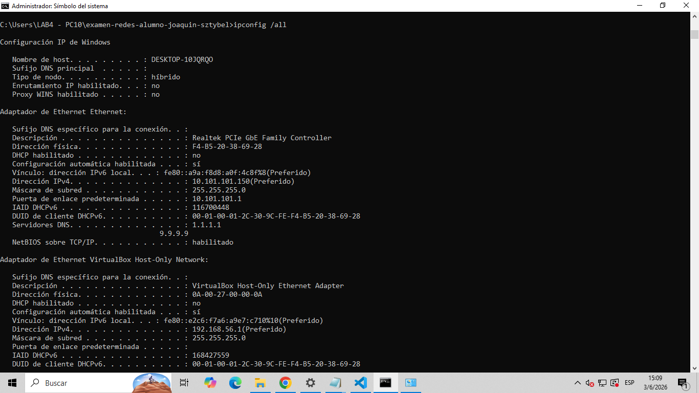
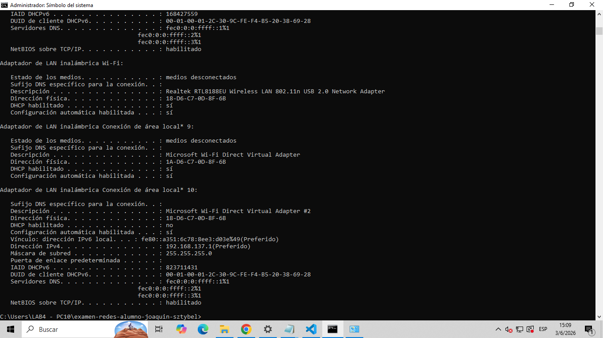
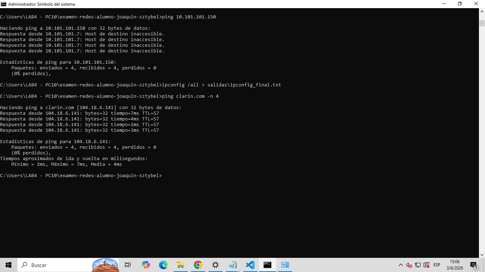
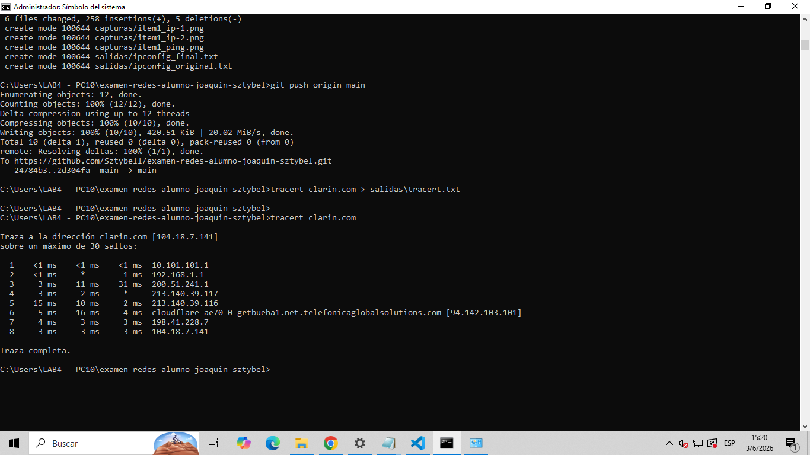
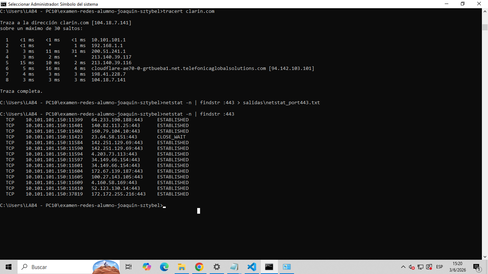
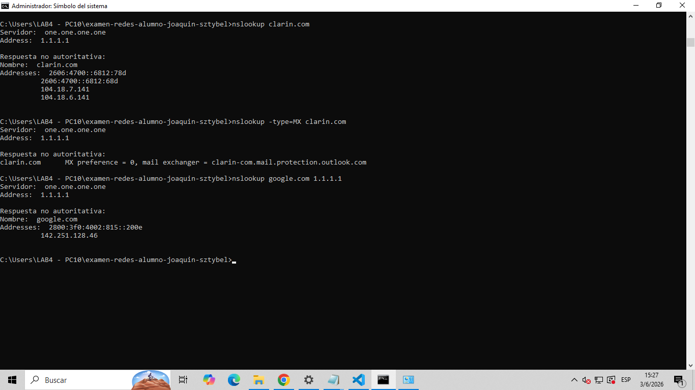
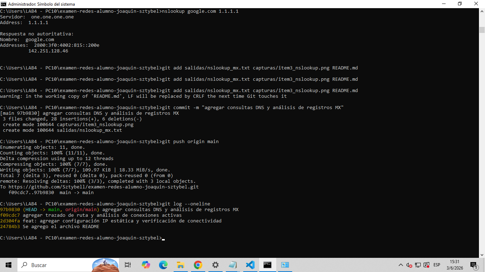
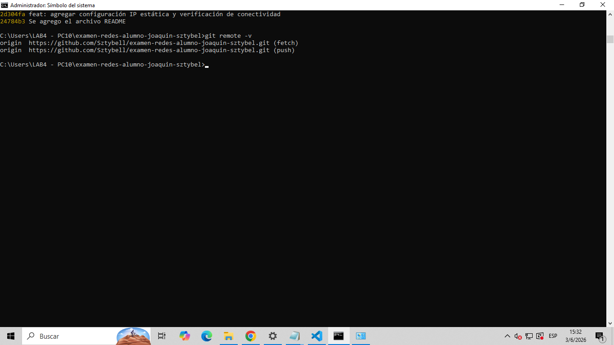
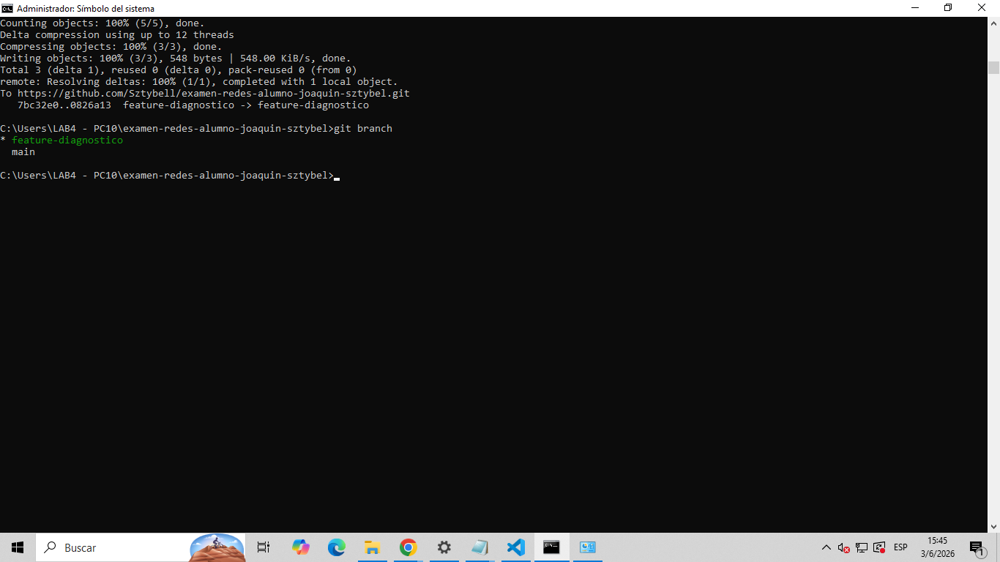
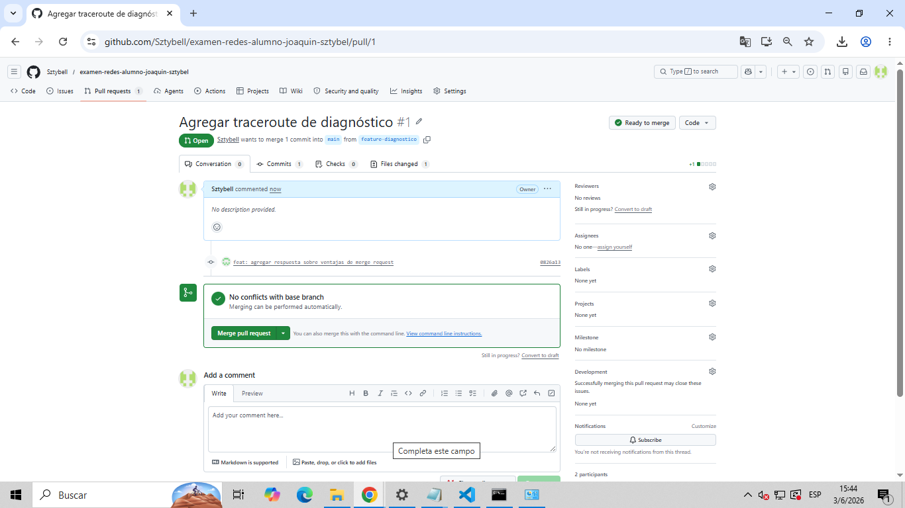

# TP Evaluativo - Redes
**Alumno:** Joaquin Nahuel Sztybel Avalos 
**Fecha:** [03/06/2026]  
**Plataforma:** GitHub
**Repositorio:** https://github.com/Sztybell/examen-redes-alumno-joaquin-sztybel

---

## Item 1 – Configuración de IP estática y conectividad

### Capturas






### Salidas de comandos (texto)
````bash
[
Configuraci¢n IP de Windows

   Nombre de host. . . . . . . . . : DESKTOP-10JQRQO
   Sufijo DNS principal  . . . . . : 
   Tipo de nodo. . . . . . . . . . : h¡brido
   Enrutamiento IP habilitado. . . : no
   Proxy WINS habilitado . . . . . : no

Adaptador de Ethernet Ethernet:

   Sufijo DNS espec¡fico para la conexi¢n. . : 
   Descripci¢n . . . . . . . . . . . . . . . : Realtek PCIe GbE Family Controller
   Direcci¢n f¡sica. . . . . . . . . . . . . : F4-B5-20-38-69-28
   DHCP habilitado . . . . . . . . . . . . . : no
   Configuraci¢n autom tica habilitada . . . : s¡
   V¡nculo: direcci¢n IPv6 local. . . : fe80::a9a:f8d8:a0f:4c8f%8(Preferido) 
   Direcci¢n IPv4. . . . . . . . . . . . . . : 10.101.101.150(Preferido) 
   M scara de subred . . . . . . . . . . . . : 255.255.255.0
   Puerta de enlace predeterminada . . . . . : 10.101.101.1
   IAID DHCPv6 . . . . . . . . . . . . . . . : 116700448
   DUID de cliente DHCPv6. . . . . . . . . . : 00-01-00-01-2C-30-9C-FE-F4-B5-20-38-69-28
   Servidores DNS. . . . . . . . . . . . . . : 1.1.1.1
                                       9.9.9.9
   NetBIOS sobre TCP/IP. . . . . . . . . . . : habilitado

Adaptador de Ethernet VirtualBox Host-Only Network:

   Sufijo DNS espec¡fico para la conexi¢n. . : 
   Descripci¢n . . . . . . . . . . . . . . . : VirtualBox Host-Only Ethernet Adapter
   Direcci¢n f¡sica. . . . . . . . . . . . . : 0A-00-27-00-00-0A
   DHCP habilitado . . . . . . . . . . . . . : no
   Configuraci¢n autom tica habilitada . . . : s¡
   V¡nculo: direcci¢n IPv6 local. . . : fe80::e2c6:f7a6:a9e7:c710%10(Preferido) 
   Direcci¢n IPv4. . . . . . . . . . . . . . : 192.168.56.1(Preferido) 
   M scara de subred . . . . . . . . . . . . : 255.255.255.0
   Puerta de enlace predeterminada . . . . . : 
   IAID DHCPv6 . . . . . . . . . . . . . . . : 168427559
   DUID de cliente DHCPv6. . . . . . . . . . : 00-01-00-01-2C-30-9C-FE-F4-B5-20-38-69-28
   Servidores DNS. . . . . . . . . . . . . . : fec0:0:0:ffff::1%1
                                       fec0:0:0:ffff::2%1
                                       fec0:0:0:ffff::3%1
   NetBIOS sobre TCP/IP. . . . . . . . . . . : habilitado

Adaptador de LAN inal mbrica Wi-Fi:

   Estado de los medios. . . . . . . . . . . : medios desconectados
   Sufijo DNS espec¡fico para la conexi¢n. . : 
   Descripci¢n . . . . . . . . . . . . . . . : Realtek RTL8188EU Wireless LAN 802.11n USB 2.0 Network Adapter
   Direcci¢n f¡sica. . . . . . . . . . . . . : 18-D6-C7-0D-8F-6B
   DHCP habilitado . . . . . . . . . . . . . : s¡
   Configuraci¢n autom tica habilitada . . . : s¡

Adaptador de LAN inal mbrica Conexi¢n de  rea local* 9:

   Estado de los medios. . . . . . . . . . . : medios desconectados
   Sufijo DNS espec¡fico para la conexi¢n. . : 
   Descripci¢n . . . . . . . . . . . . . . . : Microsoft Wi-Fi Direct Virtual Adapter
   Direcci¢n f¡sica. . . . . . . . . . . . . : 1A-D6-C7-0D-8F-6B
   DHCP habilitado . . . . . . . . . . . . . : s¡
   Configuraci¢n autom tica habilitada . . . : s¡

Adaptador de LAN inal mbrica Conexi¢n de  rea local* 10:

   Sufijo DNS espec¡fico para la conexi¢n. . : 
   Descripci¢n . . . . . . . . . . . . . . . : Microsoft Wi-Fi Direct Virtual Adapter #2
   Direcci¢n f¡sica. . . . . . . . . . . . . : 18-D6-C7-0D-8F-6B
   DHCP habilitado . . . . . . . . . . . . . : no
   Configuraci¢n autom tica habilitada . . . : s¡
   V¡nculo: direcci¢n IPv6 local. . . : fe80::a351:6c78:8ee3:d03e%49(Preferido) 
   Direcci¢n IPv4. . . . . . . . . . . . . . : 192.168.137.1(Preferido) 
   M scara de subred . . . . . . . . . . . . : 255.255.255.0
   Puerta de enlace predeterminada . . . . . : 
   IAID DHCPv6 . . . . . . . . . . . . . . . : 823711431
   DUID de cliente DHCPv6. . . . . . . . . . : 00-01-00-01-2C-30-9C-FE-F4-B5-20-38-69-28
   Servidores DNS. . . . . . . . . . . . . . : fec0:0:0:ffff::1%1
                                       fec0:0:0:ffff::2%1
                                       fec0:0:0:ffff::3%1
   NetBIOS sobre TCP/IP. . . . . . . . . . . : habilitado
]
````

````bash
[C:\Users\LAB4 - PC10\examen-redes-alumno-joaquin-sztybel>ping clarin.com -n 4

Haciendo ping a clarin.com [104.18.6.141] con 32 bytes de datos:
Respuesta desde 104.18.6.141: bytes=32 tiempo=7ms TTL=57
Respuesta desde 104.18.6.141: bytes=32 tiempo=4ms TTL=57
Respuesta desde 104.18.6.141: bytes=32 tiempo=2ms TTL=57
Respuesta desde 104.18.6.141: bytes=32 tiempo=3ms TTL=57

Estadísticas de ping para 104.18.6.141:
    Paquetes: enviados = 4, recibidos = 4, perdidos = 0
    (0% perdidos),
Tiempos aproximados de ida y vuelta en milisegundos:
    Mínimo = 2ms, Máximo = 7ms, Media = 4ms]
````

### Respuestas a las preguntas

1. .¿Qué criterio usaste para elegir tu IP esttica?   
Elegí la IP 10.101.101.150 porque está en el mismo rango que mi red (10.101.101.0/24), verifiqué con ping que no estaba ocupada, y la ubiqué lejos del rango DHCP del servidor (10.101.101.1) para evitar conflictos
2. ¿Por qu el enunciado prohibe usar los DNS de Google?  
El enunciado prohíbe usar 8.8.8.8 porque en redes institucionales o educativas se aplican políticas de filtrado DNS. Usar DNS externos los saltea, lo cual puede violar las normas de la red
---

## Item 2 – Trazado de ruta y conexiρnes activas


### Capturas






### Salidas de comandos (texto)
````bash
[Pega acá la salida de tracert al dominio]
````

````bash
[Pegá acá la salida de netstat -n | findstr :443]
````

### Respuesta

1. Salto con mayor latencia / cantidad de saltos >100ms  

2. Conexiones al puerto indicado  
   

---


## Item 3 – Consultas DNS y Resource Records


### Capturas




### Salidas de comandos (texto)

#### nslookup dominio
````bash
[Pega acá la salida del primer nslookup al dominio]
````

#### nslookup MX
````bash
[Pega acá la salida de nslookup -type=MX]
````

#### nslookup DNS
````bash
[Pegá acá la salida de nslookup a DNS externo]
````

### Respuestas

1. IP del dominio principal   

2. RR DNS  

3. Comparación con DNS por defecto

---

## Item 4 – Verificacyሁn del repositorio y remoto

### Capturas






### Salidas de comandos (texto)

````bash
[Pega acá la salida de git log --oneline]
````

````bash
[Pega acá la salida de git remote -v]
````

---

## Item 5 – Rama, Merge Request y análisis

### Capturas






### Salidas de comandos

````bash
[Pega acá la salida de git branch]
````

### Respuestas

